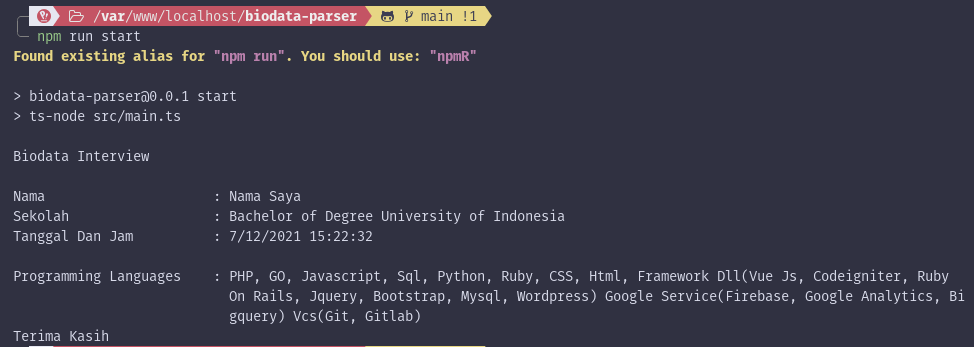

## Table of Contents

- [Overview](#overview)
- [Technical Details](#technical-details)
- [Online Demo](#online-demo)
- [Local Installation](#local-installation)
  - [With Docker](#with-docker)
  - [Manual Installation](#manual-installation)
- [Constraint](#constraint)

## Overview

Command Line Interface based application to display formatted string [bio data](./src/constants/biodata.constant.ts) in the terminal.

## Technical Details

- Tech Stack: Node.js, TypeScript (JavaScript)
  > The application entry point can be seen on [./src/main.ts](./src/main.ts)
- Programming Paradigm: Functional Programming
- Libraries: -

## Online Demo

Please visit https://replit.com/@yt2951/biodata-parser and press the "▶" icon or the "Run" button to view the online demo.

## Local Installation

### With Docker

- Requirements: Docker
- Clone this repository with `git clone https://github.com/yusuftaufiq/biodata-parser.git`
- Change the active directory to `biodata-parser`
- Run start service from `docker-compose.yml` with `docker-compose run --rm start`

### Manual Installation

- Requirements: Node.js v18 or beyond with NPM package manager installed
- Clone this repository with `git clone https://github.com/yusuftaufiq/biodata-parser.git`
- Change the active directory to `biodata-parser`
- Install dependencies with `npm install`
- Run the CLI application with `npm run start`
- Additionally, you can run the following commands:
  - `npm run format`: run code formatter with Prettier
  - `npm run lint`: run code linter with ESLint

## Constraint

- Do not resize your terminal or window while running the application because this application uses word wrap based on the size of your window
- The width of the terminal window when running the application cannot be small and should be 35 columns or wider
